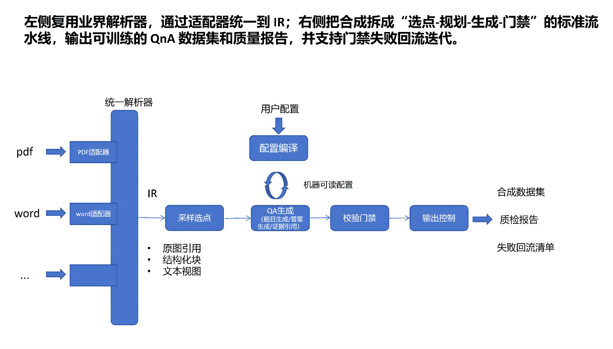

# TC-DataSynth 架构概览（W1 草案）

## 核心理念
- **Spec -> Plan**：用户配置（目标、约束）先被编译为执行计划；核心框架只感知 Plan，便于后续插拔。
- **组件可替换**：解析、采样、生成、门禁、报告均以接口形式存在，可按阶段逐步替换 mock/真实实现。

## 流水线阶段（与代码对应）
1) **Document Reader (`io/reader.py`)**  
   - 负责枚举输入文件，产生 `SourceDocument`。
2) **Parser (`pipeline/parser/`)**  
   - 将原始文件转为统一的 `IntermediateRepresentation`；W1 为 mock，后续接入 PDF/Word 解析器。
3) **Sampler (`pipeline/sampler/`)**  
   - 基于 IR 切分出 `DocumentChunk`；W2 会补充章节/语义切分。
4) **Generator (`pipeline/generator/`)**  
   - 生成 `QAPair`；当前 mock，后续对接 LLM + Prompt 管理。
5) **Quality Gates (`pipeline/validator/`)**  
   - 链式校验，阻塞或告警；W3 将扩展格式/敏感词/启发式规则。
6) **Writer (`io/writer.py`)**  
   - 将通过/失败的数据分别落盘；报告由 `runner` 写入。

## 运行模式
- **W1 Mock 模式**：不触碰 PDF 内容，利用文件名生成稳定的 mock 数据，用于验证 CLI 和数据结构。
- **Spec -> Plan**：`spec` 中描述难度/题型比例与最小证据长度，`plan` 编译后被生成器读取。
- **后续计划**：新增 `RealPdfParser`、`SemanticSampler`、`LLMQAGenerator` 等实现并替换当前注入的组件。
